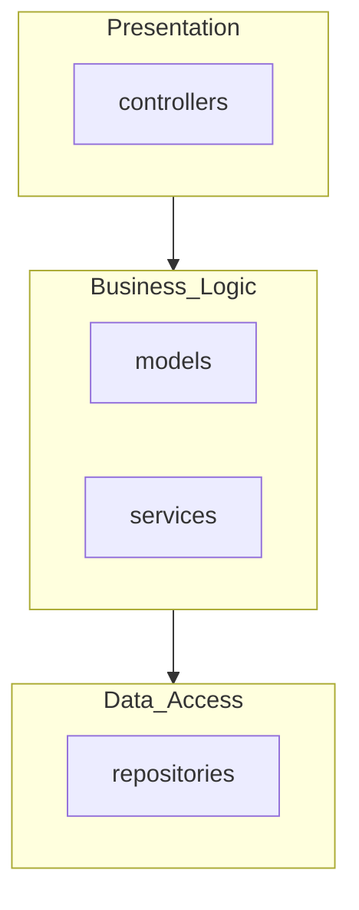
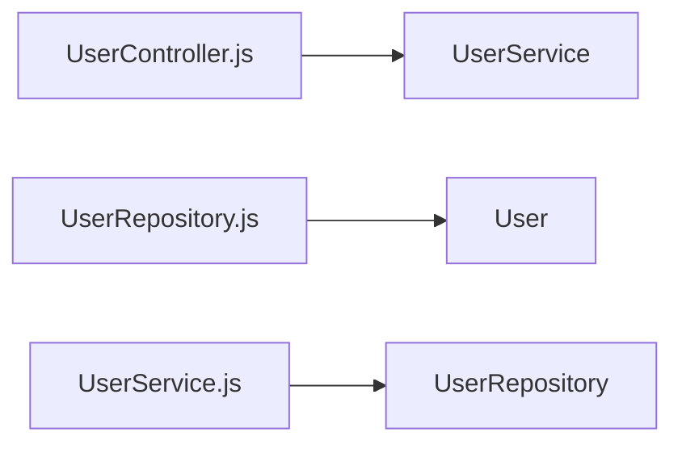

# Architecture Documentation

## Detected Architectural Patterns

### Layered Architecture (Confidence: High)
Separation of concerns into Presentation, Business Logic, and Data Access layers.

### MVC (Model-View-Controller) (Confidence: Medium)
Application structure follows Model-View-Controller pattern.

## System Layers

### Presentation Layer
**Components detected:**
- `controllers` (src\controllers)

### Business_Logic Layer
**Components detected:**
- `models` (src\models)
- `services` (src\services)

### Data_Access Layer
**Components detected:**
- `repositories` (src\repositories)

## Architectural Diagrams

### High-Level Layer View

### Component Dependency Graph
_Partial view of file dependencies_

