# Living Documentation System — UML Diagrams

> **Project:** Living Documentation System  
> **Author:** Shantharam  
> **Date:** March 2026  
> **Tools:** Mermaid.js UML Notation

---

## Table of Contents

1. [Use Case Diagrams](#1-use-case-diagrams)
2. [Class Diagrams](#2-class-diagrams)
3. [Sequence Diagrams](#3-sequence-diagrams)

---

## 1. Use Case Diagrams

### 1.1 System-Level Use Case Diagram

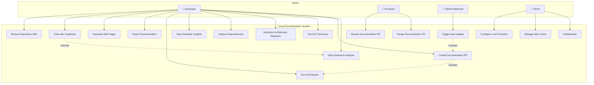

### 1.2 Chat & RAG Use Cases

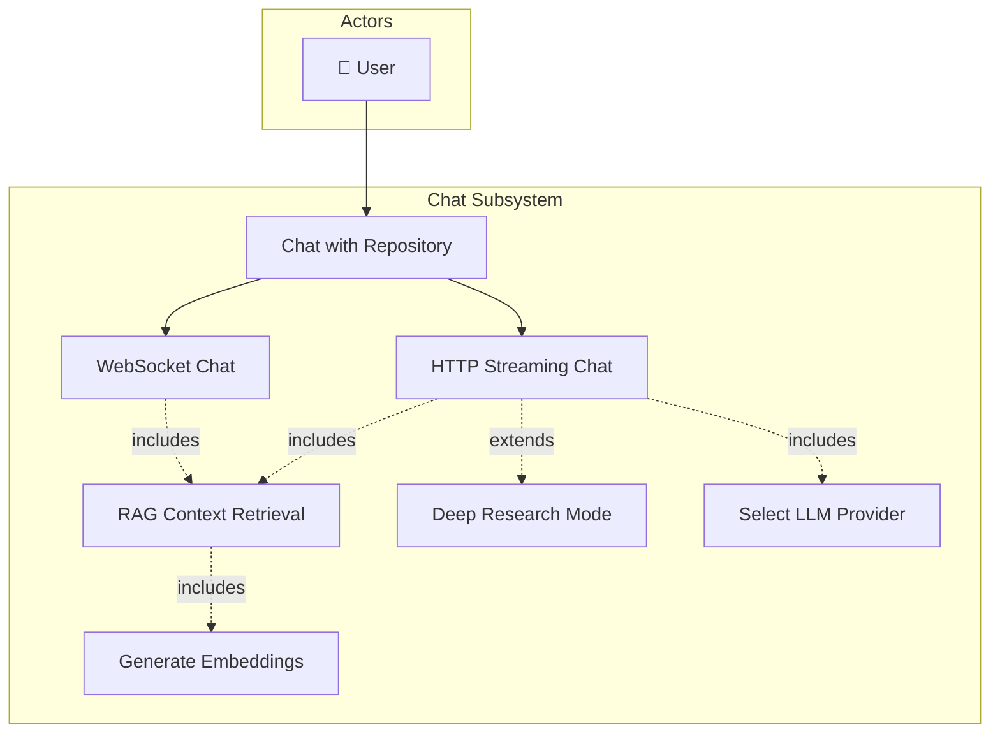

### 1.3 Documentation Intelligence Use Cases

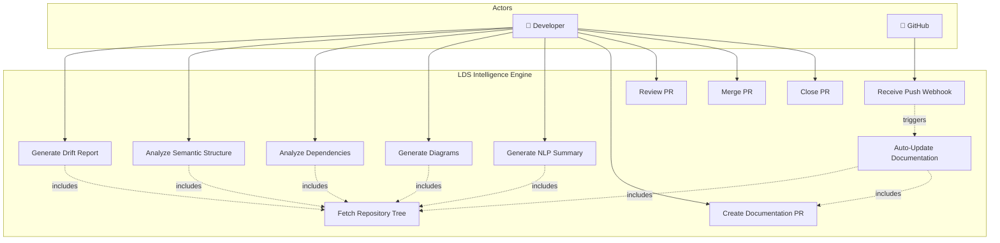

---

## 2. Class Diagrams

### 2.1 Core Application & API Layer

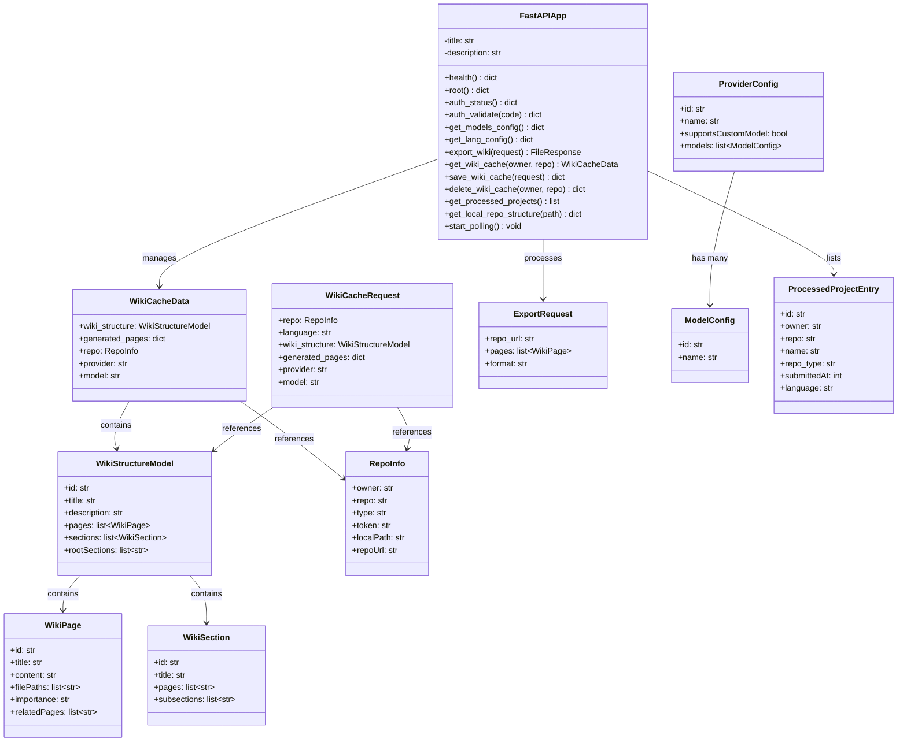

### 2.2 RAG & Data Pipeline

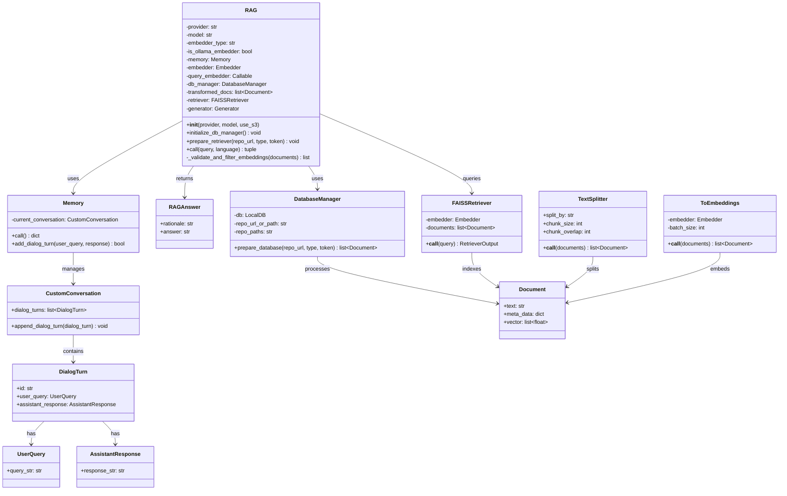

### 2.3 LLM Provider Clients (Strategy Pattern)

```mermaid
classDiagram
    class ModelClient {
        <<abstract>>
        +convert_inputs_to_api_kwargs(input, kwargs, type)* dict
        +call(api_kwargs, model_type)* Any
        +acall(api_kwargs, model_type)* Any
        +parse_chat_completion(completion)* GeneratorOutput
        +parse_embedding_response(response)* EmbedderOutput
    }

    class OpenAIClient {
        -sync_client: OpenAI
        -async_client: AsyncOpenAI
        -base_url: str
        -chat_completion_parser: Callable
        +init_sync_client() OpenAI
        +init_async_client() AsyncOpenAI
        +call(api_kwargs, model_type) Any
        +acall(api_kwargs, model_type) Any
        +parse_chat_completion(completion) GeneratorOutput
        +parse_embedding_response(response) EmbedderOutput
        +track_completion_usage(completion) CompletionUsage
    }

    class OpenRouterClient {
        -api_key: str
        -base_url: str
        -session: aiohttp.ClientSession
        +call(api_kwargs, model_type) str
        +acall(api_kwargs, model_type) str
        +convert_inputs_to_api_kwargs(input, kwargs, type) dict
        -_process_xml_content(content) str
    }

    class BedrockClient {
        -aws_access_key_id: str
        -aws_secret_access_key: str
        -aws_region: str
        -aws_role_arn: str
        -sync_client: boto3.Client
        +init_sync_client() Client
        +call(api_kwargs, model_type) Any
        +acall(api_kwargs, model_type) Any
        -_get_model_provider(model_id) str
        -_format_prompt_for_provider(provider, prompt) dict
        -_extract_response_text(provider, response) str
    }

    class AzureAIClient {
        -api_type: str
        -sync_client: AzureOpenAI
        -async_client: AsyncAzureOpenAI
        +init_sync_client() AzureOpenAI
        +init_async_client() AsyncAzureOpenAI
        +call(api_kwargs, model_type) Any
        +acall(api_kwargs, model_type) Any
        +parse_chat_completion(completion) GeneratorOutput
    }

    class DashscopeClient {
        -sync_client: OpenAI
        -async_client: AsyncOpenAI
        -base_url: str
        +init_sync_client() OpenAI
        +init_async_client() AsyncOpenAI
        +call(api_kwargs, model_type) Any
        +acall(api_kwargs, model_type) Any
        +parse_chat_completion(completion) GeneratorOutput
        +parse_embedding_response(response) EmbedderOutput
    }

    class GoogleEmbedderClient {
        -_api_key: str
        +_initialize_client() void
        +call(api_kwargs, model_type) Any
        +acall(api_kwargs, model_type) Any
        +parse_embedding_response(response) EmbedderOutput
        +convert_inputs_to_api_kwargs(input, kwargs, type) dict
    }

    class OllamaDocumentProcessor {
        -embedder: Embedder
        +__call__(documents) list~Document~
    }

    class DashScopeEmbedder {
        -model_client: ModelClient
        -model_kwargs: dict
        +call(input) EmbedderOutput
        +acall(input) EmbedderOutput
    }

    class DashScopeBatchEmbedder {
        -embedder: DashScopeEmbedder
        -batch_size: int
        -cache_path: str
        +call(input) list~EmbedderOutput~
    }

    ModelClient <|-- OpenAIClient
    ModelClient <|-- OpenRouterClient
    ModelClient <|-- BedrockClient
    ModelClient <|-- AzureAIClient
    ModelClient <|-- DashscopeClient
    ModelClient <|-- GoogleEmbedderClient

    DashScopeEmbedder --> DashscopeClient : uses
    DashScopeBatchEmbedder --> DashScopeEmbedder : wraps
    OllamaDocumentProcessor --> Document : processes
```

### 2.4 LDS Intelligence Router

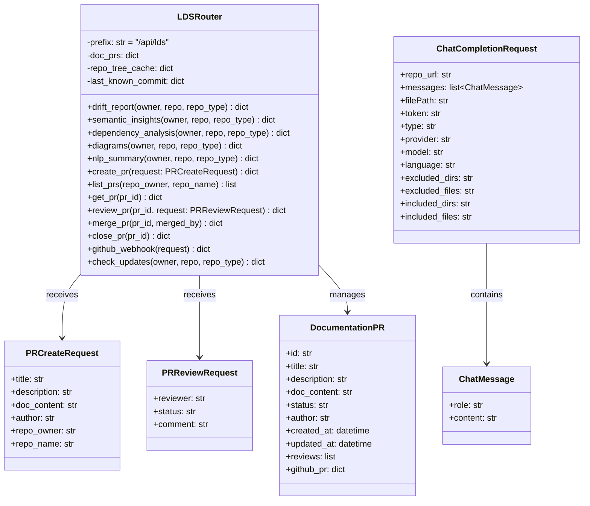

---

## 3. Sequence Diagrams

### 3.1 Chat Completion with RAG (HTTP Streaming)

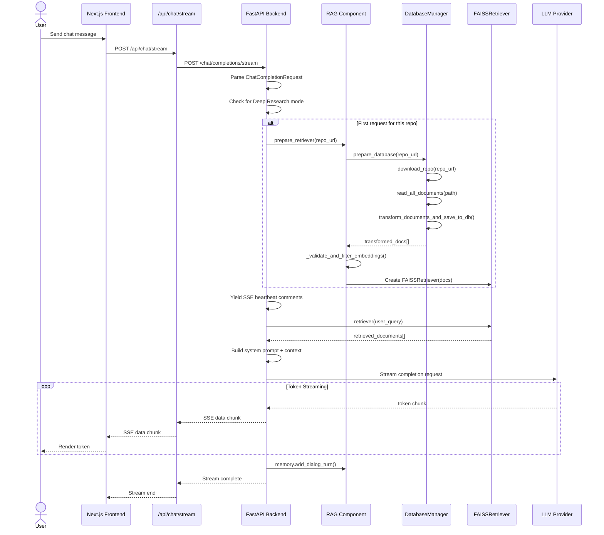

### 3.2 WebSocket Chat Flow

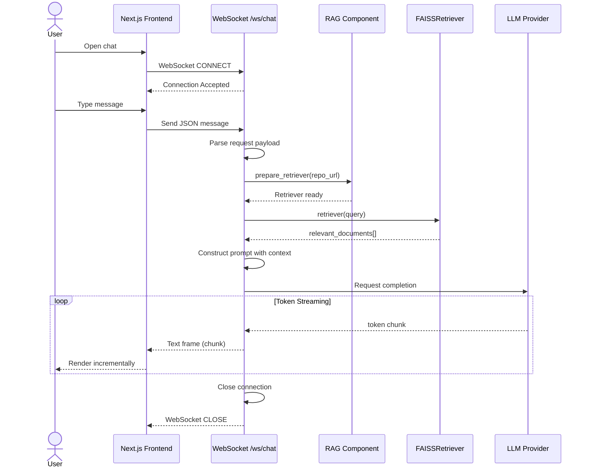

### 3.3 Documentation Drift Report Generation

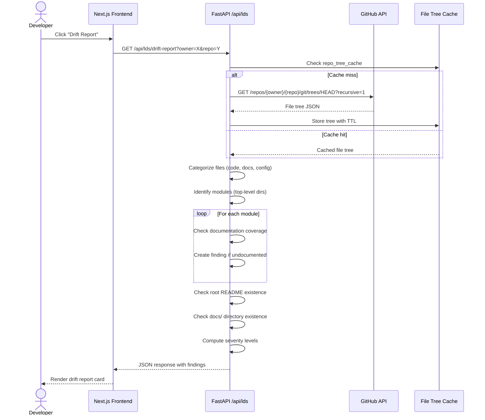

### 3.4 Automatic Documentation Update via Webhook

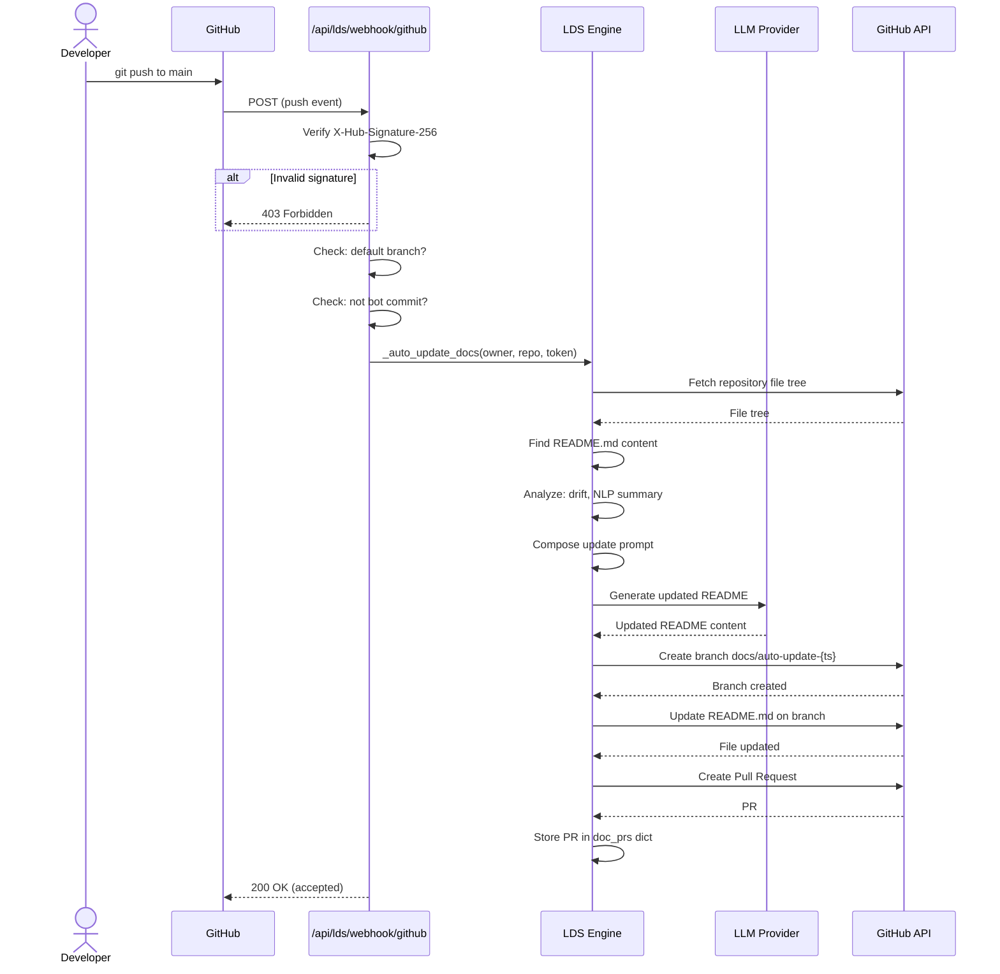

### 3.5 Wiki Generation & Export

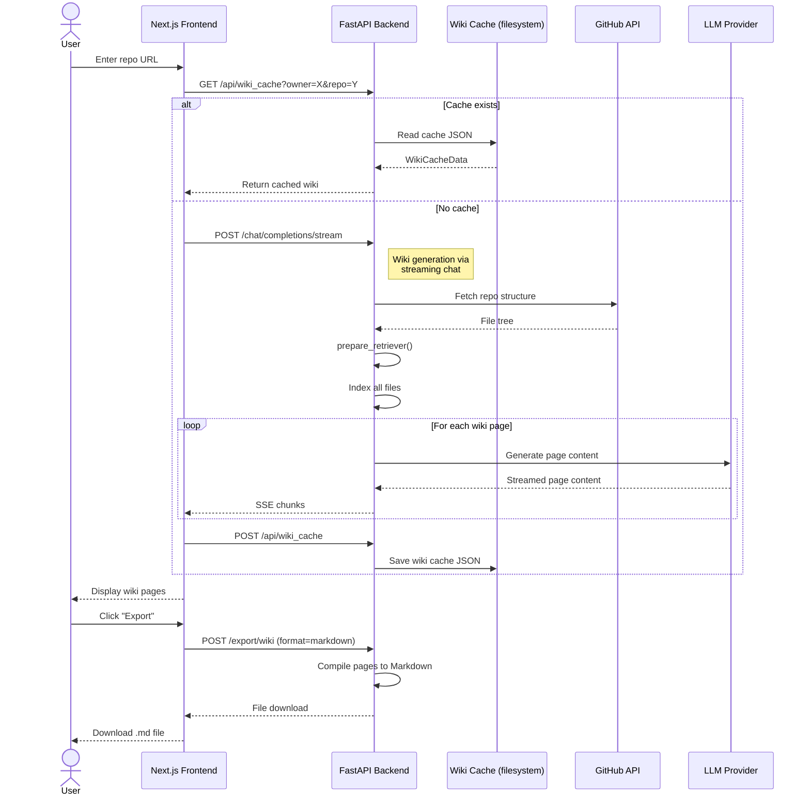

### 3.6 Pull Request Lifecycle

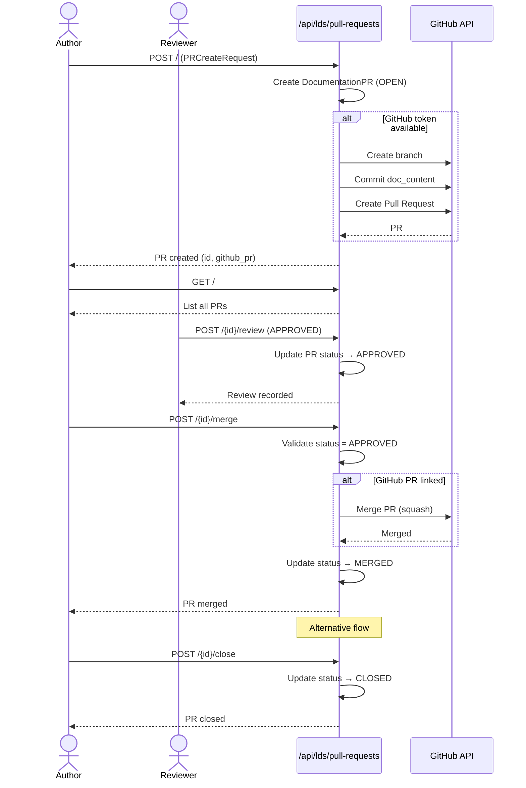

### 3.7 LLM Provider Selection (Strategy Pattern)

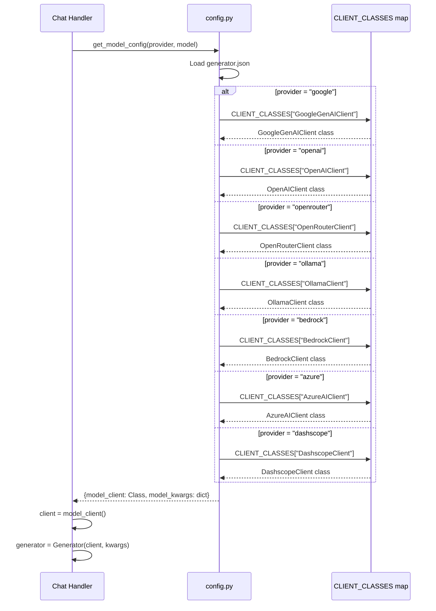

### 3.8 Data Pipeline — Document Embedding

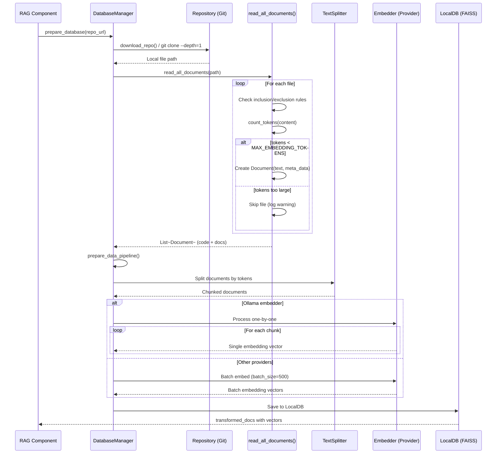

---

> _UML Diagrams for the Living Documentation System — Generated March 2026_
